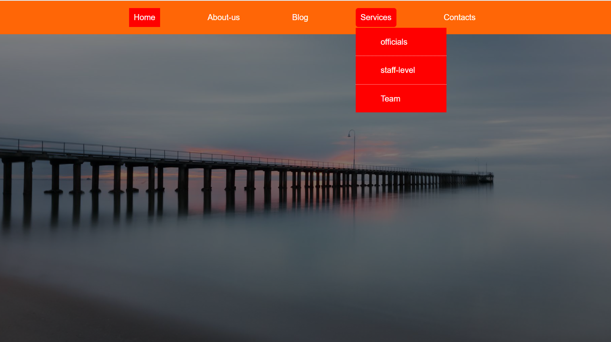
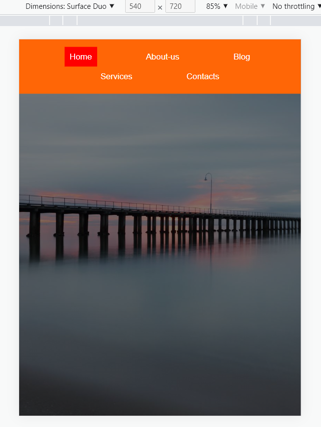
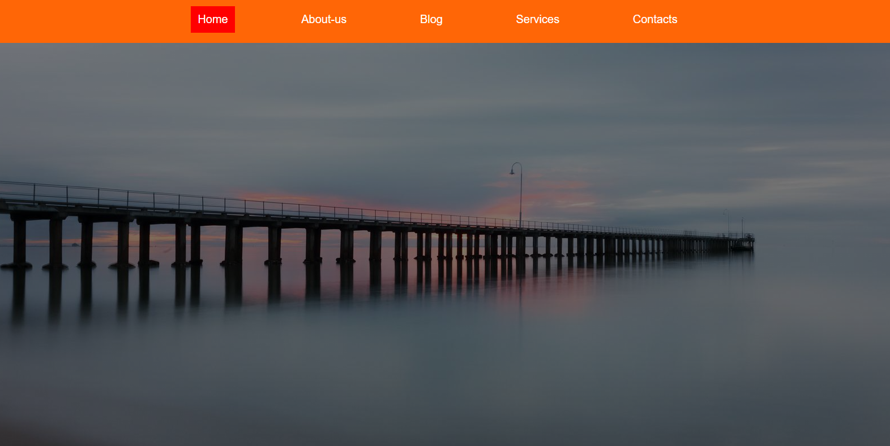
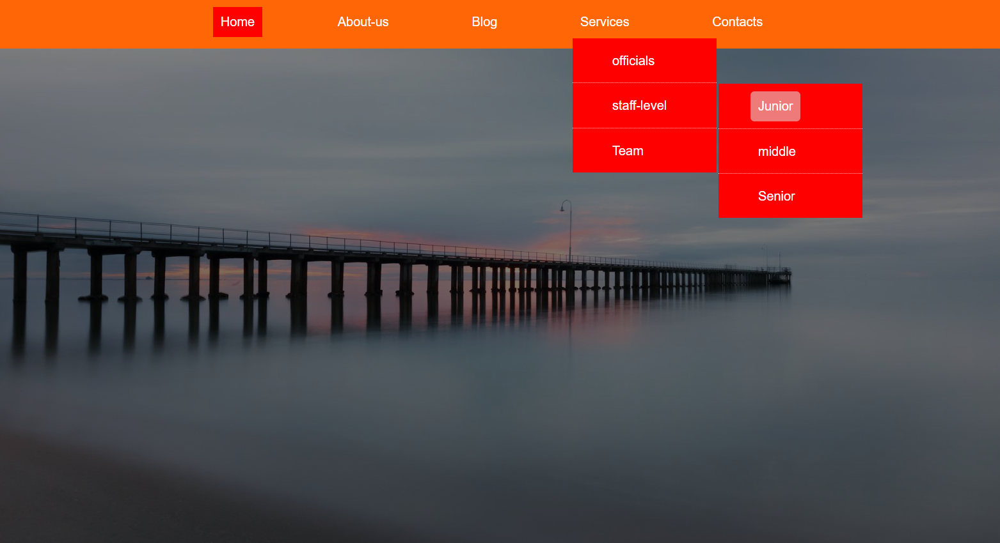
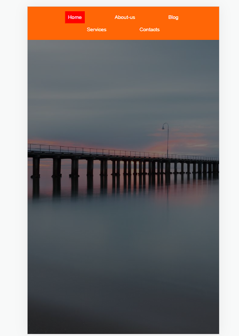

# CREATION OF LANDING PAGE 3

## A WEB DESIGN LANDING PAGE

## Welcome back!!!

##let's get started.

Thank you for checking this work.

## About This Work:

This work is created for the purpose of practising and revising (HTML & CSS) with right and well measured web units for the purpose of ensuring effective layout of website, and other HTML templates.

## pictures of this Work

##An Example##
##Collective collections##

##process##
THIS FILE IS FOR THE PRACTISE OF HTML(DEEPER)
-PRACTISE FOR THE BUILDING OF MODERN SEMANTIC WEBSITE
-STRUCTURES OF DIFFERENT ELEMENTS, MOSTLY BLOCK ELEMENTS.
-PRACTISED THE USE OF PROPER MARKNG-UP FOR BETTER RESULTS WITHIN A SHORT PEROID OF TIME.

THIS FILE IS FOR THE PRACTISE OF CSS

-PRACTISED IN DETAILS NESTING OF ELEMENTS TO CREATE DROP DOWN LINKS.
-USED FLEXBOX TO CONTROL THE DISPLAY PATTERN TOO.
-USED THE QUERY PROPERTIES(MEDIA) IN ENSURING SMOOTH LAYOUT WITH ALL CHECKPOINTS BEING MET.
-IT'S ALSO RESPONSVE......

##Larger screen sizes##

##smaller screen sizes##

## Built with

      -HTML(Hypertext Mark-up Language)
      -CSS(Cascading Styles Sheet)

## My Challanges and lessons

Learnt how to create well scalable pictures with background properties, used my fontsizes well, Used my pixels for nice elements that will remain permanent in size as the work goes on. HTML was fun working with while my css was ok but tidious and fun, got to know the right and best pseudo classes to use.

## Installations

-For those Farmiliar with Git-hub you can clone the repo and pull to your local workplace to view.

-For those who want to check the work from the site, click here [https://chukwuma5.github.io/Basic-nav-project/], to view Thank you once again.

-For those who want to view the first file through drop box, click here [https://www.dropbox.com/sh/kh84wdqyrcxpvlx/AADxmilZuKAkwwKFnJ6-28ixa?dl=0], to view Thank you once again.

-For those who want to view the second file through git-hub, click here [https://github.com/chukwuma5/Basic-nav-project], to view Thank you once again.

## Best syntax Used

    ``CSS

(queries(media)), (flex-box), and (power of proper font usage).
Media queries is very important to practise building easy and responsive layout stuctures for all sections in the site. You will see them all around modern websites and web apps.
``

## Resources that helped

-For the Colors[https://htmlcolorcodes.com/color-names/]

-For the icons[https://fontawesome.com/v5.15/icons/instagram?style=brands] and svg's in the folder.

-For the Fonts[https://fonts.google.com/]

-For the images, you can use 1.[https://unsplash.com/]

-For the images, you can use 2.[https://pixabay.com/]

## Licsense

This work is under [MIT] liscence. It's highly free and opensource to anyone.
